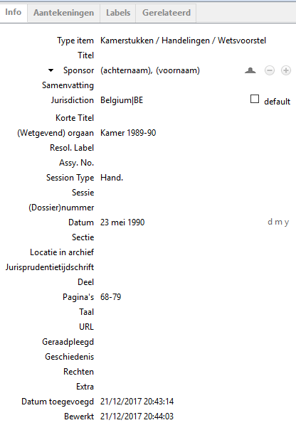
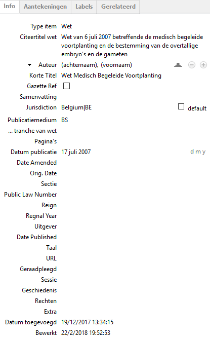
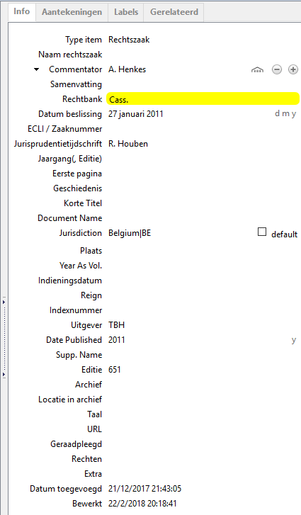

Doordat de stylesheet nog niet grondig getest is, is het mogelijk dat velden nog van betekenis veranderen. Daardoor is het mogelijk dat latere versies niet meer dezelfde velden gebruiken en de items in Zotero/Juris-M moeten worden aangepast. ****

Installatie
===========

Installeer Zotero of Juris-M
----------------------------

Juris-M is een Zotero variant toegespitst op juridisch verwijzen. Dit voegt ondersteuning toe voor zaken als Kamerstukken, wetten en jurisprudentie.

Om naar die zaken te kunnen verwijzen is dus Juris-M nodig. De bibliotheken, instellingen etc. uit Zotero zijn compatibel met Juris-M.

Zie: <https://juris-m.github.io/downloads/>

Installeer Stylesheet
---------------------

Toevoegen van Stylesheet in Zotero/Juris-M: Bewerken -> Citeren -> 

! In Zotero geeft dit een waarschuwing dat het Stylesheet niet aan de csl 1.0.1 voldoet, dit is omdat de extra opties voor Juris-M zijn toegevoegd

Toevoegen aan de bibliotheek
============================

Kamerstukken
------------

*Hand*. Kamer 1989-90, 23 mei 1990, 68–79.

Veld | Soort waarde | Voorbeeld
--- | --- | ---
Type Item | ’Kamerstukken / Handelingen / Wetsvoorstel’ | 
Jurisdiction | Belgium|BE | 
(Wetgevend) orgaan | Tekst + datum | Kamer 1989-90
Session Type | Afkorting zoals opgenomen in V|A | Hand. ; Parl. St ; Vr. en Antw.
Datum | een geldige datum | 23 mei 1990
Sectie | Getal | 309
Pagina’s | Relevante pagina’s | 68-79

Wet
---

Wet van 6 juli 2007 betreffende de medisch begeleide voortplanting en de bestemming van de overtallige embryos en de gameten, *BS* 17 juli 2007 (Wet Medisch Begeleide Voortplanting).

Veld | Soort waarde | Voorbeeld
--- | --- | ---
Type Item | Wet | 
Jurisdiction | Belgium|BE | 
Citeertitel wet | Tekst | Wet van 6 juli 2007 betreffende de medisch begeleide voortplanting en de bestemming van de overtallige embryos en de gameten
Korte Titel | Korte tekst | 
Publicatiemedium | Tekst | 
Datum publicatie | Datum | 17 juli 2007

Rechtspraak
-----------

Cass. 27 januari 2011, *TBH* 2011, 651, concl. A. HENKES, noot R. HOUBEN.

Veld | Soort waarde | Voorbeeld
--- | --- | ---
Type Item | Rechtszaak | 
Jurisdiction | Belgium|BE | 
Naam rechtszaak | Tekst in Zotero/Juris-M | X en Y
Commentator | By auteur te vinden | A. Henkes
Korte Titel | Naam waaronder zaak bekend staat | 
Rechtbank | Afkorting van de rechtbank | Cass.
Datum beslissing | Geldige datum | 27 januari 2011
Jurisprudentietijdschrift*| Tekst met annotator (in het Engels is dit een logische veldnaam)*| R. Houben
ECLI | ECLI | Nog niet gebruikt in V & A
Indexnummer | Niet-ECLI zaaknummer | 
Uitgever*| Naam van blad waarin jurisprudentie verschenen is.*| TBH
Date Published | Datum van publicatie | 2011
Editie | Editie van jurisprudentietijdschrift | 651

Boeken, tijdschriften, etc..
============================

Geen bijzonderheden.

Afkortingen
============================
In de Style-editor -> rechtsboven "Abbrev/Afkortingen" -> klik "importeren" -> selecteer JSON lijst met afkortingen -> Importeer

Afkortingen voor tijdschriften cf. [rechtsaf.be](http://www.rechtsaf.be)